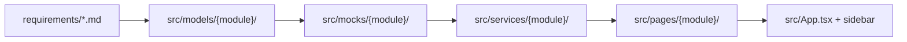
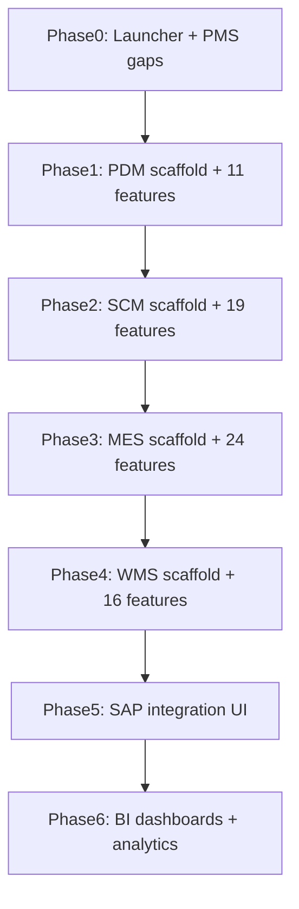

# Full Requirements Implementation Plan

## Current State

| Module | Specs | Status |
|--------|-------|--------|
| **3.1 PMS** | 42 | ~39 done; **3 gaps** remain |
| **3.2 PDM** | 12 | Models only ([`src/models/pdm/index.ts`](src/models/pdm/index.ts)) |
| **3.3 SCM** | 20 | Models only ([`src/models/scm/index.ts`](src/models/scm/index.ts)) |
| **3.4 MES** | 25 | Models only ([`src/models/mes/index.ts`](src/models/mes/index.ts)) |
| **3.5 WMS** | 17 | Models only ([`src/models/wms/index.ts`](src/models/wms/index.ts)) |
| **3.6 SAP** | 8 | Models only ([`src/models/sap/index.ts`](src/models/sap/index.ts)) |
| **3.7 BI** | 12 | Models only ([`src/models/bi/index.ts`](src/models/bi/index.ts)) |

**Established pattern** (from org-unit spec and existing PMS code):



Reference implementations: [`src/pages/pms/admin/OrgStructurePage.tsx`](src/pages/pms/admin/OrgStructurePage.tsx), [`src/services/pms/admin/org-service.ts`](src/services/pms/admin/org-service.ts), [`src/mocks/pms/store.ts`](src/mocks/pms/store.ts).

---

## Phase 0 — Platform Shell & PMS Completion

### 0.1 Unified ERP launcher (replaces placeholder shell)

Replace [`src/pages/Dashboard.tsx`](src/pages/Dashboard.tsx) and retire inline-mock pages [`Inventory.tsx`](src/pages/Inventory.tsx), [`Orders.tsx`](src/pages/Orders.tsx), [`Customers.tsx`](src/pages/Customers.tsx), [`Reports.tsx`](src/pages/Reports.tsx) with redirects or removal.

**New launcher** at `/`:
- Module cards for PMS, PDM, SCM, MES, WMS, SAP, BI with status badges (`Live` / `Coming soon` → `Live` as each module ships)
- Quick stats pulled from each module's mock dashboard service
- Update [`src/components/layout/AppSidebar.tsx`](src/components/layout/AppSidebar.tsx) to accordion groups per module (mirror PMS accordion pattern)

### 0.2 Finish remaining PMS specs (3 files)

| Spec | Routes to add | Key artifacts |
|------|---------------|---------------|
| [3.1.9.1 PDCA proposal](requirements/3.1.9.1-pdca-proposal-submission.md) | `/pms/pdca/proposals`, `/new`, `/:id` | `pdca-service.ts`, `pdca-store.ts`, `PdcaProposalsPage`, `PdcaProposalFormPage`; HR pre-fill from [`AppraisalHrPage`](src/pages/pms/appraisal/AppraisalHrPage.tsx) via `?fromHr=` |
| [3.1.9.2 PDCA execution](requirements/3.1.9.2-pdca-execution-tracking.md) | `/pms/pdca/executions`, `/:id` | Execution tracker with status stepper, action items, evidence attachments (mock filenames) |
| [3.1.10.1 Report center](requirements/3.1.10.1-standard-fixed-reports.md) | `/pms/reports` | Catalog + generator panel + preview pane; mock PDF/Excel export toasts; link appraisal published cycles from [`AppraisalFinalPage`](src/pages/pms/appraisal/AppraisalFinalPage.tsx) |

Extend [`src/models/pms/operations.ts`](src/models/pms/operations.ts) (`PdcaProposalSchema` already exists) with execution/report DTOs. Add PDCA + Reports nav items to PMS sidebar and [`src/lib/navigation/page-meta.ts`](src/lib/navigation/page-meta.ts).

---

## Phase 1 — PDM (12 specs)

**Prerequisite for SCM/MES/WMS** — product styles, BOM, routing, and process data flow downstream.

### 1.1 Scaffold ([3.2.1 module positioning](requirements/3.2.1-module-core-positioning.md))

```
src/
  components/pdm/PdmLayout.tsx
  pages/pdm/PdmHomePage.tsx
  mocks/pdm/pdm-dashboard-store.ts
  services/pdm/pdm-dashboard-service.ts
```

Routes under `/pdm/*` per positioning doc. Sidebar accordion: **Product Data (PDM)**.

### 1.2 Feature delivery order

| Wave | Specs | Routes (from requirements) |
|------|-------|---------------------------|
| A — Lifecycle | 3.2.2.1, 3.2.2.2, 3.2.2.3, 3.2.2.4 | `/pdm/projects`, `/pdm/designs`, `/pdm/sampling`, `/pdm/finalization` |
| B — Process & routing | 3.2.3.1, 3.2.3.2, 3.2.3.3, 3.2.3.4 | `/pdm/processes`, `/pdm/working-hours`, `/pdm/routing` |
| C — BOM & cost | 3.2.4, 3.2.5 | `/pdm/bom`, `/pdm/cost-pricing` |
| D — Change control | 3.2.6 | `/pdm/changes` |

**Per-spec checklist** (repeat for each file in [`requirements/`](requirements/)):
1. Extend Zod schemas in [`src/models/pdm/`](src/models/pdm/) to match spec DTO tables
2. Seed mock store with cross-linked IDs (style → BOM → routing)
3. Service functions with `randomDelay()` + `ApiError` validation
4. Pages with `PageHeader`, `AsyncState`, `PermissionGate`, RHF+Zod forms, `DataTable`
5. All four UI states (loading/empty/error/success) per [`.cursor/rules/ui-ux-standards.mdc`](.cursor/rules/ui-ux-standards.mdc)

---

## Phase 2 — SCM (20 specs)

### 2.1 Scaffold ([3.3.1](requirements/3.3.1-module-core-positioning.md))

- Layout + home at `/scm`
- Customer portal stub at `/portal/orders` (read-only order tracking for 3.3.2.5)
- Cross-module KPI badges referencing PDM finalized products

### 2.2 Feature delivery order

| Wave | Specs | Focus |
|------|-------|-------|
| A — Master & sales | 3.3.2.1–3.3.2.6 | Customers, order creation, review, change, tracking, shipment closure |
| B — Procurement | 3.3.3.1–3.3.3.5 | Suppliers, requisitions, POs, arrival/IQC, reconciliation |
| C — Planning | 3.3.4.1–3.3.4.6 | Demand/resources, scheduling engine UI, Gantt-style visualization, dispatch, urgent orders, plan PDCA |
| D — Extended | 3.3.5, 3.3.6 | Subcontracting, import/export shipping |

**Cross-module mocks:** Sales orders carry `ProductStyleId` from PDM; PO lines reference WMS inbound queue IDs (seed placeholders, wire in Phase 4).

---

## Phase 3 — MES (25 specs)

### 3.1 Scaffold ([3.4.1](requirements/3.4.1-module-core-positioning.md))

- Routes under `/mes/*`
- Shared **Pad layout** component (`src/components/mes/PadLayout.tsx`) — 360px-first for shop-floor screens per requirements README

### 3.2 Feature delivery order

| Wave | Specs | UI notes |
|------|-------|----------|
| A — Work orders | 3.4.2.1–3.4.2.5 | WO reception, split/merge, dispatch/picking, Bao-Gong reporting, closure |
| B — Scheduling | 3.4.3 | Workshop line scheduling board |
| C — Production processes | 3.4.4.1–3.4.4.4 | Cutting, sewing/hanging, post-processing, RFID traceability (scan mock) |
| D — Quality | 3.4.5.1–3.4.5.4 | IPQC, OQC, rework, traceability analysis |
| E — Equipment | 3.4.6.1–3.4.6.5 | Ledger, status monitoring, maintenance, OEE, tooling |
| F — Labor & cost | 3.4.7.1–3.4.7.3, 3.4.8, 3.4.9 | Teams, labor collection, piece-rate wages, cost mgmt, production reports |

Work orders link to SCM sales orders; material picks link forward to WMS outbound mocks.

---

## Phase 4 — WMS (17 specs)

### 4.1 Scaffold ([3.5.1](requirements/3.5.1-module-core-positioning.md))

- Routes under `/wms/*`
- Shared **PDA layout** (`src/components/wms/PdaLayout.tsx`) — scan-centric 360px flows
- Admin vs PDA route split (e.g. `/wms/inbound/purchase` + `/wms/pda/inbound/purchase`)

### 4.2 Feature delivery order

| Wave | Specs | Focus |
|------|-------|-------|
| A — Master | 3.5.2.1–3.5.2.3 | Warehouse/zone/location, material master, strategy config |
| B — Inbound | 3.5.3.1–3.5.3.3 | Purchase, production output, miscellaneous inbound (+ PDA) |
| C — Outbound | 3.5.4.1–3.5.4.3 | Production picking, sales shipping, misc outbound (+ PDA) |
| D — Inventory ops | 3.5.5.1–3.5.5.4, 3.5.6, 3.5.7, 3.5.8 | Transfer, alerts, batch/shelf-life, reservation, counting, traceability, reports |

Reuse `ScanField` component across PDA flows. Inventory balances must reconcile with SCM PO receipts and MES production output mocks.

---

## Phase 5 — SAP Integration (8 specs)

### 5.1 Scaffold ([3.6.1](requirements/3.6.1-module-core-positioning.md))

- Routes under `/sap/*`
- Integration monitor as home dashboard

### 5.2 Feature delivery order

| Spec | Screen focus |
|------|-------------|
| 3.6.2 | Architecture diagram + adapter spec viewer |
| 3.6.3 | Master data sync queue (PDM/SCM entities) |
| 3.6.4 | Procure-to-Pay flow monitor |
| 3.6.5 | Order-to-Cash flow monitor |
| 3.6.6 | Production cost accounting sync |
| 3.6.7 | Inventory valuation sync |
| 3.6.8 | Sync monitoring, retry, exception inbox |

Read-only integration UI — no backend; mock sync logs reference transactional IDs from SCM/MES/WMS stores.

---

## Phase 6 — BI (12 specs)

### 6.1 Scaffold ([3.7.1](requirements/3.7.1-module-core-positioning.md))

- Routes under `/bi/*`
- Shared chart components in `src/components/bi/` (shadcn Chart + Recharts)
- Role-based home redirect (executive vs operational vs execution tier)

### 6.2 Feature delivery order

| Wave | Specs | Focus |
|------|-------|-------|
| A — Dashboards | 3.7.2.1–3.7.2.7 | Executive, SCM, MES, WMS, SAP financial, KPI/PMS, site kanban |
| B — Analytics platform | 3.7.3, 3.7.4, 3.7.5, 3.7.6 | RT-OLAP explorer, report designer, alerts/forecasting, multi-terminal layout |

BI mocks **aggregate** from prior module stores (e.g. `bi-dashboard-store.ts` reads SCM order counts, MES OEE, WMS stock levels). Read-only — no mutations.

---

## Cross-Cutting Work (every phase)

### Shared infrastructure to add once in Phase 1

| Artifact | Purpose |
|----------|---------|
| `src/components/shared/ScanField.tsx` | Barcode scan input for WMS PDA + MES Pad |
| `src/components/shared/StatusStepper.tsx` | Workflow timelines (inbound, WO, sync) |
| `src/components/shared/ModuleHomeCard.tsx` | Launcher + per-module overview KPIs |
| `src/contexts/module-auth-context.tsx` or extend `PmsAuthProvider` | Module-scoped permission keys |
| `src/mocks/shared/cross-links.ts` | Stable UUIDs linking orders → WOs → inventory |

### Per-requirement acceptance gate

From each spec's acceptance criteria section:
- Routes registered in [`src/App.tsx`](src/App.tsx)
- Nav + breadcrumbs in layout + [`page-meta.ts`](src/lib/navigation/page-meta.ts)
- Types match [`docs/nyxapi-route-reference.md`](docs/nyxapi-route-reference.md) field names
- Loading / empty / error / success states
- Destructive actions use `ConfirmDialog`
- Mobile layouts where spec calls for PDA/Pad/kanban

### Testing approach (manual, no test suite required unless requested)

Smoke-walk each spec's Phase 3 transition table: verify every listed navigation path works with mocked data.

---

## Suggested File Tree (final target)

```
src/
  pages/
    Dashboard.tsx          → ERP launcher
    pms/   (existing + pdca/, reports/)
    pdm/   (12 feature areas)
    scm/   (sales, procurement, scheduling, …)
    mes/   (work-orders, quality, equipment, …)
    wms/   (admin + pda/ subfolder)
    sap/   (integration monitors)
    bi/    (dashboards, designer, kanban)
  mocks/{pms,pdm,scm,mes,wms,sap,bi}/
  services/{pms,pdm,scm,mes,wms,sap,bi}/
  models/{pms,pdm,scm,mes,wms,sap,bi}/   (extend existing)
  components/{pdm,scm,mes,wms,sap,bi,shared}/
```

---

## Effort Estimate

| Phase | Specs | Relative effort |
|-------|-------|-----------------|
| 0 — Shell + PMS gaps | 3 + launcher | Small (1–2 days) |
| 1 — PDM | 12 | Medium (1–2 weeks) |
| 2 — SCM | 20 | Large (2–3 weeks) |
| 3 — MES | 25 | Large (3–4 weeks) |
| 4 — WMS | 17 | Large (2–3 weeks; PDA doubles surface) |
| 5 — SAP | 8 | Medium (1 week) |
| 6 — BI | 12 | Medium–Large (2 weeks; chart-heavy) |

**Total:** ~10–14 weeks for a single developer following strict dependency order. PMS foundation already saves ~6–8 weeks.

---

## Implementation Sequence Diagram



Each phase ends with: module home live on ERP launcher, sidebar accordion complete, cross-links to upstream module mocks verified.
