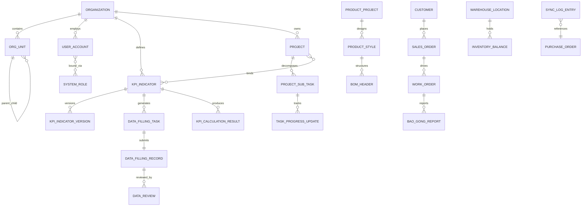

# Marketplace-ERP Data Architecture

**Version:** 1.0  
**Last updated:** 2026-06-14  
**Scope:** KPI-PMS (3.1), PDM (3.2), SCM (3.3), MES (3.4), WMS (3.5), SAP Integration (3.6), BI (3.7)  
**Code artifacts:** `src/models/` (Zod-validated domain models), `docs/nyxapi-route-reference.md` (platform API contract)

---

## 1. Executive Summary & Architectural Patterns (The "Why")

### 1.1 Business context

Marketplace-ERP is a multi-module manufacturing ERP for **automotive leather processing**. Data spans master data (PDM), transactional operations (SCM, MES, WMS), performance management (KPI-PMS), financial sync (SAP), and analytics (BI). The platform must support:

- **Hierarchical organizations** (company → plant → department → workshop → line → process → shift)
- **Versioned master data** (BOM, routing, KPI formulas, org structure)
- **Workflow-heavy processes** (order review, project approval, appraisal, alert disposal)
- **Time-series operational data** (production reporting, inventory movements, KPI calculations)
- **Cross-module traceability** (sales order → work order → WIP RFID → shipment → KPI)

### 1.2 Workload & consistency analysis

| Domain | Read/Write profile | Latency | Volume (3-yr estimate) | Consistency |
|--------|-------------------|---------|------------------------|-------------|
| PMS admin (org, users, roles) | Low write, moderate read | < 200 ms | 10⁴ rows/tenant | **ACID** |
| KPI indicator library | Low write, high read | < 200 ms | 10³ indicators | **ACID** |
| Project & task management | High write, high read | < 300 ms | 10⁶ tasks | **ACID** |
| Data collection forms | Burst write (period-end) | < 500 ms | 10⁷ submissions/yr | **ACID** |
| KPI calculation jobs | Batch write, read-heavy | Minutes (async) | 10⁸ result rows | **ACID** + idempotent jobs |
| MES shop-floor reporting | Very high write | < 100 ms ingest | 10⁸ events/yr | **ACID** per WO; eventual for aggregates |
| WMS inventory movements | High write | < 200 ms | 10⁷ movements/yr | **ACID** (stock must not go negative) |
| SCM orders | Moderate write | < 300 ms | 10⁶ order lines | **ACID** |
| SAP sync | Moderate write, retry-heavy | Seconds (async) | 10⁶ sync events | **At-least-once** + idempotency keys |
| BI dashboards | Read-heavy | < 2 s (cached) | Pre-aggregated | **BASE** (CQRS read models) |
| Operation logs | Append-only write | < 100 ms | 10⁹ rows (partitioned) | **Append-only immutability** |

**Decision:** Use **PostgreSQL** as the system of record (ACID) for all transactional domains. Use **read replicas + materialized views** for BI. Use **Redis** for session cache, dashboard cache, and job locks. Use **object storage** (S3-compatible) for attachments. NyxAPI `RecordDto.Data` (jsonb) hosts extensible attributes; ERP domain tables hold relational integrity.

### 1.3 Architectural patterns

| Pattern | Application |
|---------|-------------|
| **Multi-tenant row isolation** | Every table includes `organization_id`; composite indexes lead with tenant key |
| **Domain-Driven Design** | Bounded contexts: `pms`, `pdm`, `scm`, `mes`, `wms`, `sap`, `bi` |
| **CQRS (light)** | OLTP in PostgreSQL; BI aggregates in read models / RT-OLAP engine |
| **Event-driven integration** | Domain events (`WorkOrderCompleted`, `InventoryMoved`, `KpiDataApproved`) feed KPI sync and SAP |
| **Optimistic concurrency** | `modified_datetime` + row version on mutable aggregates |
| **Soft delete** | `is_disabled` / `is_active` flags; no physical delete for audit entities |
| **Versioning** | KPI indicators, org structure, BOM, product styles maintain version history tables |
| **Outbox pattern** | SAP sync and notification dispatch via transactional outbox |
| **Idempotent workers** | KPI batch calc and SAP sync keyed by `(organization_id, job_id, period)` |

### 1.4 Technology stack (persistence layer)

```
┌─────────────────────────────────────────────────────────────┐
│                     Application Layer                        │
│  NyxAPI (C#) │ Marketplace-ERP UI │ Integration adapters    │
└──────────────┬──────────────────────────────────────────────┘
               │
┌──────────────▼──────────────────────────────────────────────┐
│  PostgreSQL 16 (primary OLTP)  │  Redis 7 (cache/locks)     │
│  Read replica(s) for BI        │  S3 (attachments/exports)  │
└─────────────────────────────────────────────────────────────┘
```

### 1.5 Frontend model layer (`src/models/`)

TypeScript **Zod schemas** validate API payloads and mock data at runtime. Conventions:

- **PascalCase** field names (matches NyxAPI JSON contract)
- `*Schema` exports with inferred `type` aliases
- `parseModel()` / `safeParseModel()` from `src/models/common/parse.ts`
- Cross-field rules via `.superRefine()` (weight sums, date ordering, tier/tag binding)

---

## 2. Conceptual & Logical Data Models

### 2.1 Entity-relationship overview



### 2.2 PMS — System Basic Management (3.1.1)

#### `org_unit`

| Column | Type | Constraints |
|--------|------|-------------|
| `id` | UUID | PK |
| `organization_id` | UUID | FK → organization, NOT NULL |
| `parent_id` | UUID | FK → org_unit, NULL for root |
| `code` | VARCHAR(32) | NOT NULL, UNIQUE per org |
| `name` | VARCHAR(200) | NOT NULL |
| `tier_type` | ENUM | company, plant, department, workshop, line, process, shift |
| `process_tag` | VARCHAR(100) | NULL; **required** when tier_type = process |
| `sort_order` | INT | NOT NULL, ≥ 0 |
| `is_disabled` | BOOLEAN | DEFAULT false |
| `created_by` | UUID | NOT NULL |
| `created_datetime` | TIMESTAMPTZ | NOT NULL |
| `modified_by` | UUID | NULL |
| `modified_datetime` | TIMESTAMPTZ | NULL |

**Indexes:** `(organization_id, parent_id, name)` UNIQUE where not disabled; `(organization_id, tier_type)`; `(organization_id, is_disabled)`.

**Validations:** Sibling `name` unique under same `parent_id`; disabling parent cascades `is_disabled` to descendants (application trigger).

#### `user_account`

| Column | Type | Constraints |
|--------|------|-------------|
| `id` | UUID | PK |
| `organization_id` | UUID | FK, NOT NULL |
| `login_account` | VARCHAR(100) | UNIQUE per org |
| `employee_id` | VARCHAR(50) | UNIQUE per org |
| `employee_name` | VARCHAR(200) | NOT NULL |
| `department_id` | UUID | FK → org_unit |
| `position` | VARCHAR(100) | NOT NULL |
| `status` | ENUM | active, disabled |
| `password_hash` | VARCHAR(255) | NOT NULL (server only) |
| Audit columns | | |

**Indexes:** `(organization_id, employee_id)` UNIQUE; `(organization_id, department_id)`; `(organization_id, status)`.

#### `system_role` / `user_role_binding`

- `system_role`: menu_permissions JSONB, button_permissions JSONB, data_scope ENUM, custom_filter TEXT
- `user_role_binding`: composite PK `(user_id, role_id)`; FK to user_account, system_role

#### `dictionary_category` / `dictionary_item`

- Composite UNIQUE `(category_code, item_code)` and `(category_code, display_name)`
- Builtin categories: DELETE prohibited (trigger); disable only

#### `operation_log` (append-only)

- No UPDATE/DELETE grants; partitioned by `operated_at` monthly
- `before_data` / `after_data` JSONB for diff audit

#### `system_parameter`

- UNIQUE `(organization_id, code)`
- `is_core` flag forces confirmation workflow in UI

### 2.3 PMS — KPI Indicator Library (3.1.2)

#### `kpi_indicator`

| Column | Type | Constraints |
|--------|------|-------------|
| `id` | UUID | PK |
| `organization_id` | UUID | FK |
| `code` | VARCHAR(50) | UNIQUE globally per org; regex `^[A-Z0-9_]+$` |
| `name` | VARCHAR(200) | NOT NULL |
| `formula` | TEXT | NOT NULL; validated before save |
| `target_value` | DECIMAL(18,4) | NOT NULL, > 0 |
| `cycle` | ENUM | daily…annual |
| `data_source` | ENUM | auto, manual, mixed |
| `status` | ENUM | enabled, disabled |
| `is_core_locked` | BOOLEAN | DEFAULT false |
| `current_version` | VARCHAR(10) | e.g. V1.0 |

**FK:** `category` → dictionary_item; evaluation object scopes data visibility.

#### `kpi_indicator_version`

- UNIQUE `(indicator_id, version)`; immutable snapshot JSONB

### 2.4 PMS — Project Management (3.1.3)

#### `project`

| Column | Type | Constraints |
|--------|------|-------------|
| `id` | UUID | PK |
| `code` | VARCHAR(32) | UNIQUE per org |
| `name` | VARCHAR(200) | UNIQUE per org |
| `planned_start` | DATE | NOT NULL |
| `planned_end` | DATE | NOT NULL, > planned_start |
| `budget_amount` | DECIMAL(18,2) | > 0 |
| `leader_id` | UUID | FK → user_account |
| `status` | ENUM | pending_approval…archived |

#### `project_sub_task`

- FK `project_id`; FK `owner_id` → user_account
- `prerequisite_task_ids` via junction table `task_dependency (task_id, prerequisite_task_id)` with cycle detection (recursive CTE on insert)

#### `task_progress_update`

- `progress_pct` INT CHECK 0–100
- At 100%: `attachments` array must be non-empty (CHECK via trigger)
- `actual_date` ≥ task.planned_start

#### `project_issue` / `issue_disposal_log`

- Status machine: open → assigned → resolved → closed
- FK to project, sub_task, handler user

#### `project_kpi_mapping`

- Composite PK `(project_id, kpi_indicator_id)` — configured at initiation for F-PROJ-008 sync

### 2.5 PMS — Data Collection (3.1.4)

#### `data_filling_task`

- Generated by scheduler per `(indicator_id, period_label, assignee_id)`
- UNIQUE `(indicator_id, period_label, assignee_id)`
- Status: pending → submitted → overdue → approved/rejected

#### `data_filling_record`

- FK `task_id`; `field_values` JSONB validated against template schema
- Status: draft → pending_review → approved (locked) / rejected

#### `data_review`

- Multi-level: `review_level` ENUM team, department
- Approved records are **immutable** (trigger blocks UPDATE)

### 2.6 PMS — KPI Calculation (3.1.5)

#### `kpi_calculation_job`

- Idempotency key: `(organization_id, cycle, period_label)`
- Status: running → success | partial | failed
- `results` stored in `kpi_calculation_result (job_id, indicator_id, value, status)`

#### `kpi_recalculation_request`

- Async job queue; `history_retained` always true — prior results in `kpi_calculation_result_history`

### 2.7 PDM (3.2) — Master data

| Entity | Key relationships |
|--------|-------------------|
| `product_project` | → product_style; status workflow |
| `product_style` | → bom_header, process_route; versioned |
| `bom_header` / `bom_line` | Multi-level via `parent_line_id`; FK material master |
| `change_request` | Polymorphic `(entity_type, entity_id)`; version_from → version_to |

**Indexes:** `(organization_id, style_number, version)` UNIQUE on BOM; GIN on routing operations JSONB.

### 2.8 SCM (3.3)

| Entity | Key relationships |
|--------|-------------------|
| `customer` | credit_limit, tier |
| `sales_order` / `sales_order_line` | FK customer; FK style/material |
| `order_review` | Four-stage JSONB pipeline per order |
| `supplier` | qualification_status |
| `purchase_order` | FK supplier; drives WMS inbound |

### 2.9 MES (3.4)

| Entity | Key relationships |
|--------|-------------------|
| `work_order` | FK sales_order_line optional; status machine |
| `bao_gong_report` | FK work_order, process; qty caps enforced |
| `ipqc_inspection` | FK work_order; defect_count ≤ sample_size |
| `equipment` | FK line; live status in Redis with periodic flush |

### 2.10 WMS (3.5)

| Entity | Key relationships |
|--------|-------------------|
| `warehouse_tree` | Self-referential location hierarchy |
| `material_warehouse_profile` | min_stock ≤ max_stock |
| `inventory_balance` | UNIQUE (location_id, material_id, batch_number) |
| `inventory_transfer` | Double-entry: decrement source, increment destination in transaction |
| `warehouse_alert` | Triggered on threshold breach |

### 2.11 SAP Integration (3.6)

| Entity | Key relationships |
|--------|-------------------|
| `integration_config` | One per org; encrypted credentials |
| `sync_log_entry` | Append-only; payload_hash for dedup |
| `p2p_sync_document` | FK purchase_order; idempotent upsert to SAP |

### 2.12 BI (3.7)

- Read models denormalized from OLTP via CDC or scheduled ETL
- `bi_dashboard_snapshot` keyed by `(dashboard_id, filter_hash, refreshed_at)`
- No direct writes from UI — refresh from RT-OLAP engine

---

## 3. Data Flow & Pipeline Architecture

### 3.1 Ingestion paths

```
┌──────────────┐     ┌──────────────┐     ┌──────────────┐
│ Manual forms │     │ MES Pad/PDA  │     │ SAP adapter  │
│ (PMS DATA)   │     │ (Bao-Gong)   │     │ (idoc/api)   │
└──────┬───────┘     └──────┬───────┘     └──────┬───────┘
       │                    │                    │
       ▼                    ▼                    ▼
┌──────────────────────────────────────────────────────────┐
│              PostgreSQL OLTP (ACID transactions)          │
└──────────────────────────┬───────────────────────────────┘
                           │ CDC / domain events
                           ▼
┌──────────────────────────────────────────────────────────┐
│  Event bus → KPI calc worker │ SAP outbox │ BI ETL      │
└──────────────────────────┬───────────────────────────────┘
                           ▼
┌──────────────────────────────────────────────────────────┐
│  KPI results │ Materialized views │ Redis dashboard cache │
└──────────────────────────────────────────────────────────┘
```

### 3.2 PMS KPI pipeline

1. **Configure** indicators (3.1.2) and traffic-light rules (3.1.6.3)
2. **Collect** manual data (3.1.4) or auto-sync from projects (3.1.3.8) / MES / WMS
3. **Review** multi-level approval locks records
4. **Calculate** scheduled batch (3.1.5.1) or manual recalc (3.1.5.2)
5. **Consume** via cockpits (3.1.6), appraisal (3.1.8), BI (3.7), reports (3.1.10)

### 3.3 Cross-module traceability chain

`SalesOrder` → `WorkOrder` → `BaoGongReport` → `InventoryBalance` → `KpiCalculationResult` → `AppraisalScheme` → `FinalReview`

Each link stores `source_entity_type` + `source_entity_id` for drill-down (F-DASH-002, F-PROJ-008).

### 3.4 SAP sync pipeline (async, at-least-once)

1. Domain event committed in OLTP
2. Outbox row inserted in same transaction
3. Worker polls outbox → calls SAP API
4. `sync_log_entry` records outcome; retry with exponential backoff
5. Idempotency via `payload_hash` UNIQUE constraint

### 3.5 BI consumption

- RT-OLAP engine queries read replica
- Dashboard cache in Redis TTL 30s–5m (configurable per cockpit)
- Drill-down resolves to OLTP source via traceability keys

---

## 4. Security, Compliance, and Data Governance

### 4.1 Encryption

| Layer | Mechanism |
|-------|-----------|
| In transit | TLS 1.2+ everywhere |
| At rest | PostgreSQL TDE or volume encryption; S3 SSE |
| Secrets | SAP credentials, API keys in vault; never in jsonb payloads |
| Passwords | bcrypt/Argon2 server-side only; not in `src/models` |

### 4.2 Authentication & authorization

- NyxAPI JWT (ADB2C) per `docs/nyxapi-route-reference.md`
- Row-level security: `data_scope` on system_role filters queries by department/individual
- Field-level: `is_core_locked` on KPI indicators; operation_log is read-only for all roles

### 4.3 PII handling

| Field | Classification | Retention |
|-------|---------------|-----------|
| employee_name, login_account | PII | Life of employment + 7 years |
| login_ip in operation_log | PII | 2 years |
| Performance scores | Sensitive HR | 7 years; access restricted by role |
| Customer contact data | PII | Contract duration + regulatory |

PII fields masked in non-HR UI contexts; export requires `export` button permission.

### 4.4 Data retention & immutability

| Entity | Policy |
|--------|--------|
| operation_log | Permanent; no DELETE/UPDATE (DB trigger + privilege revocation) |
| kpi_calculation_result_history | Permanent |
| Approved data_filling_record | Immutable |
| Archived project | Sealed; no structural edits |
| Sync logs | 7 years minimum |
| Dashboard cache | Ephemeral (Redis TTL) |

### 4.5 Compliance controls

- **Audit trail:** All mutating operations → operation_log with before/after JSONB
- **Version history:** org_unit, kpi_indicator, bom_header, product_style
- **Segregation of duties:** Appraisal workflow enforces Auditor ≠ HR ≠ CFO paths
- **Data residency:** `organization_id` scopes all data; tenant pinned to region

### 4.6 Governance roles

| Role | Capability |
|------|------------|
| System administrator | Org, users, roles, parameters |
| KPI administrator | Indicator library, calculation jobs |
| Auditor | Data review, appraisal preliminary, alert verification |
| Department manager | Scoped data per data_scope |
| Employee | Own tasks, filling, PDCA proposals |

---

## 5. Referential Integrity, Indexes & Field Validation Catalog

### 5.1 Foreign key matrix (selected)

| Child table | FK column | Parent | ON DELETE |
|-------------|-----------|--------|-----------|
| org_unit | parent_id | org_unit | RESTRICT |
| org_unit | organization_id | organization | CASCADE |
| user_account | department_id | org_unit | RESTRICT |
| user_role_binding | user_id | user_account | CASCADE |
| user_role_binding | role_id | system_role | RESTRICT |
| kpi_indicator_version | indicator_id | kpi_indicator | CASCADE |
| project | leader_id | user_account | RESTRICT |
| project_sub_task | project_id | project | CASCADE |
| project_sub_task | owner_id | user_account | RESTRICT |
| task_dependency | task_id | project_sub_task | CASCADE |
| data_filling_task | indicator_id | kpi_indicator | RESTRICT |
| data_filling_record | task_id | data_filling_task | RESTRICT |
| sales_order | customer_id | customer | RESTRICT |
| work_order | organization_id | organization | CASCADE |
| bao_gong_report | work_order_id | work_order | RESTRICT |
| inventory_balance | location_id | warehouse_tree | RESTRICT |
| sync_log_entry | organization_id | organization | CASCADE |

### 5.2 Index strategy

1. **Tenant-first:** All composite indexes begin with `organization_id`
2. **Workflow queues:** Partial indexes on status columns, e.g. `WHERE status = 'pending_review'`
3. **Time-series:** BRIN on `operated_at`, `created_datetime` for logs and events
4. **Search:** GIN on JSONB (`field_values`, `before_data`, `button_permissions`)
5. **Uniqueness:** Natural keys (employee_id, project code, kpi code) per organization

### 5.3 Field validation catalog (application + DB)

| Rule ID | Entity | Rule | Enforced in |
|---------|--------|------|-------------|
| V-ORG-001 | org_unit | process tier requires process_tag | Zod `OrgUnitSchema`, CHECK |
| V-ORG-002 | org_unit | sibling name unique | Zod, UNIQUE index |
| V-USR-001 | user_account | employee_id unique per org | Zod, UNIQUE |
| V-USR-002 | user_account | ≥ 1 role bound | Zod |
| V-KPI-001 | kpi_indicator | code unique, uppercase | Zod, UNIQUE |
| V-KPI-002 | kpi_indicator | target_value > 0 | Zod, CHECK |
| V-KPI-003 | kpi_indicator | weights sum to 100% | Zod (appraisal scheme) |
| V-PRJ-001 | project | planned_end > planned_start | Zod, CHECK |
| V-PRJ-002 | project | budget > 0 | Zod, CHECK |
| V-TSK-001 | task_progress | progress 0–100 integer | Zod, CHECK |
| V-TSK-002 | task_progress | 100% requires attachments | Zod |
| V-DATA-001 | data_filling | required fields non-empty | Zod superRefine |
| V-DATA-002 | data_filling | values within min/max | Zod superRefine |
| V-WO-001 | work_order | completed + scrap ≤ planned | Zod |
| V-BG-001 | bao_gong_report | defect reason if unqualified > 0 | Zod |
| V-WMS-001 | material_profile | max_stock ≥ min_stock | Zod, CHECK |
| V-TL-001 | traffic_light_rule | bands non-overlapping | Zod superRefine |

### 5.4 Code model mapping

| Module | Schema files | Primary entities |
|--------|-------------|------------------|
| `src/models/pms/` | organization, identity, configuration, kpi, project, data-collection, operations | OrgUnit, UserAccount, KpiIndicator, Project, AlertRule, AppraisalScheme |
| `src/models/pdm/` | index | ProductProject, BomHeader, ChangeRequest |
| `src/models/scm/` | index | Customer, SalesOrder, Supplier, PurchaseOrder |
| `src/models/mes/` | index | WorkOrder, BaoGongReport, IpqcInspection, Equipment |
| `src/models/wms/` | index | WarehouseTreeNode, MaterialWarehouseProfile, InventoryTransfer |
| `src/models/sap/` | index | IntegrationConfig, SyncLogEntry, P2pSyncDocument |
| `src/models/bi/` | index | BiDashboardPayload |
| `src/models/common/` | primitives, enums, parse | Uuid, DateTime, AuditFields, parseModel |
| `src/models/api/` | envelopes | APIResponse, PagedList |

### 5.5 Usage example

```ts
import { parseModel, ProjectSchema } from '@/models'

const project = parseModel(ProjectSchema, apiPayload)
```

---

## Appendix A — NyxAPI platform mapping

Generic NyxAPI `RecordDto` stores extensible attributes in `Data` (jsonb). ERP domain tables map to NyxAPI objects as:

| ERP entity | NyxAPI object (proposed) | Lookup key |
|------------|--------------------------|------------|
| org_unit | `pms-org-unit` | `Code` |
| kpi_indicator | `pms-kpi-indicator` | `Code` |
| project | `pms-project` | `Code` |
| product_style | `pdm-style` | `StyleNumber` |
| sales_order | `scm-sales-order` | `OrderNumber` |
| work_order | `mes-work-order` | `WorkOrderNumber` |

Synchronization uses `Lookupnames` array for cross-reference resolution per NyxAPI conventions.

---

## Appendix B — Document history

| Version | Date | Author | Changes |
|---------|------|--------|---------|
| 1.0 | 2026-06-14 | Data Architecture | Initial comprehensive architecture + Zod models |
